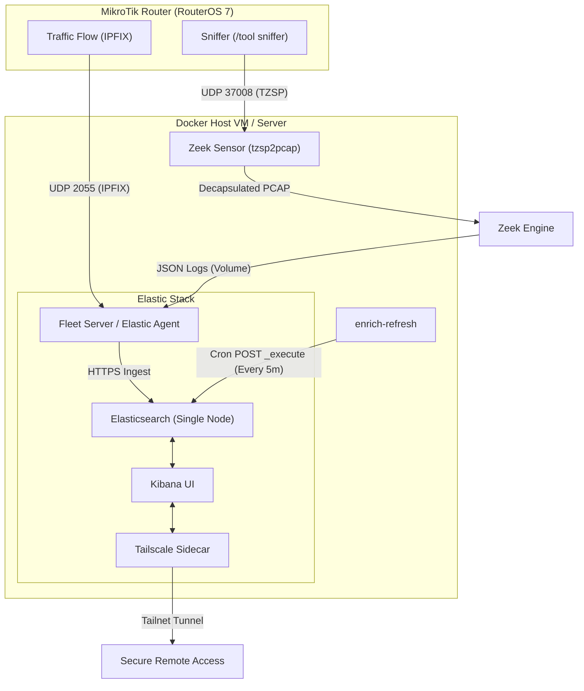

# MikroTik RouterOS to Elastic (ELK) Home LAN Traffic Analysis Stack

This project implements a comprehensive home-LAN traffic analysis stack running in Docker. It ingests metadata and packet capture streams from a MikroTik router (running RouterOS 7), processes the data, performs dynamic IP-to-domain and friendly-name enrichments, and presents the insights in prebuilt Kibana dashboards.

Secure external access to the Kibana interface is provided out-of-the-box via a Tailscale sidecar.

---

## Architecture

The diagram below details the data flow from the MikroTik router to the Dockerized Elastic Stack:



---

## Component Overview

This stack is managed by [docker-compose.yml](docker-compose.yml) and utilizes the configuration values in [.env](.env):

1. **Elasticsearch (`es01`)**: A single-node instance running with security and TLS enabled. Certificates are generated automatically on the initial launch by the temporary `setup` helper container.
2. **Kibana (`kibana`)**: The user interface configured in [kibana.yml](kibana.yml) with pre-enrolled agent policies and packages for NetFlow, System, and Elastic Agent.
3. **Fleet Server (`fleet-server`)**: A containerized Elastic Agent configured in Fleet Server mode. It manages the policy definitions and acts as the receiver for NetFlow data, while simultaneously tailing the JSON logs emitted by Zeek.
4. **Tailscale Sidecar (`kibana-ts`)**: Shares Kibana's network namespace (`network_mode: service:kibana`) and handles Tailscale Serve mapping. It exposes the Kibana UI securely over your Tailnet (e.g. `https://kibana.<tailnet-name>.ts.net`) using automatic Let's Encrypt certificates.
5. **Zeek Sensor (`zeek`)**: Built using a custom [Dockerfile](zeek/Dockerfile). It compiles `tzsp2pcap` to decapsulate incoming TZSP UDP packets on port `37008` and pipes them into Zeek.
    * It applies local network rules configured in [local-elk.zeek](zeek/local-elk.zeek) to tag local/remote origins.
    * Active logs are written as JSON objects. A background sweeper script inside the container regularly removes rotated files older than 2 hours to prevent disk exhaustion.
6. **Enrichment Scheduler (`enrich-refresh`)**: Reuses the Elasticsearch image to query the Elasticsearch REST API every 5 minutes. This refreshes the DNS-to-IP lookup index snapshots, enabling the NetFlow ingest pipeline to match dynamic IP traffic with corresponding domain names.

---

## Data Enrichment & Pipelines

A major feature of this stack is its ability to make sense of IP flows through automated enrichments located in the [enrichment/](enrichment/) directory:

- **DNS Parsing**: Ingest pipelines parse RouterOS raw DNS logging packets to capture mapping relationships between LAN IPs and resolved domains.
- **Enrichment Policies**: The transform pipeline ([dns-latest.transform.json](enrichment/dns-latest.transform.json)) maintains a lookup mapping IPs to their most recent resolved domains. The enrich-refresh container triggers the execution of these policies so that incoming NetFlow streams get decorated with readable domain names (`destination.domain`).

---

## Kibana Dashboards

The dashboards are defined programmatically using Python scripts in the [dashboards/](dashboards/) directory:

1. **NetFlow Overview**: Generated by [build_netflow_dashboard.py](dashboards/build_netflow_dashboard.py). Visualizes bandwidth consumption, top talkers, connection directions, protocols, and geo-destinations.
2. **Zeek Threat Hunting**: Generated by [build_zeek_threat_dashboard.py](dashboards/build_zeek_threat_dashboard.py). Analyzes DNS anomalies, TLS/certificates hygiene, uncommonly used ports, file hashes, and active Zeek alerts.

### Setting Up Friendly Hostnames
You can map static/DHCP IPs on your LAN to friendly names.
1. Open [build_zeek_threat_dashboard.py](dashboards/build_zeek_threat_dashboard.py).
2. Edit the `DEVICE_MAP` dictionary (e.g. mapping `192.168.88.244` to `"Roku-TV"`).
3. Re-run the python script to update the dashboard saved-objects JSON files.
4. Import the updated dashboard into Kibana.

---

## Setup & Deployment Guide

### 1. Prerequisites
- Docker & Docker Compose installed on the host.
- Host system with 16 GB+ RAM (recommended to allocate 8 GB heap to ES in `.env`).
- A MikroTik router running RouterOS 7 with network access to the Docker host.

### 2. Configure Environment Variables
Copy and customize the [.env](.env) template:
- Set secure passwords for `ELASTIC_PASSWORD` and `KIBANA_PASSWORD`.
- Enter your Tailscale auth key in `TS_AUTHKEY` to enable external Kibana URL resolution.

### 3. Spin Up the Stack
Run the following command to start all services in the background:
```bash
docker compose up -d
```
You can monitor the setup container logs to verify when it completes the initial certificate generation and user configuration:
```bash
docker compose logs -f setup
```

### 4. Configure the MikroTik Router

#### Configure NetFlow (IPFIX)
Access your router's CLI and apply the following configuration to stream IPFIX data:
```routeros
/ip traffic-flow set enabled=yes active-flow-timeout=1m inactive-flow-timeout=15s
/ip traffic-flow target add dst-address=<DOCKER_HOST_IP> port=2055 version=ipfix
```

#### Configure TZSP Packet Sniffer
Configure the sniffer to stream WAN (or LAN) packets over TZSP to the Zeek container:
```routeros
/tool sniffer set streaming-enabled=yes streaming-server=<DOCKER_HOST_IP>:37008 filter-interface=ether1 filter-stream=yes
/tool sniffer start
```

---

## Operational References & Troubleshooting

Several dedicated operational guides are available in the repository to handle specific production scenarios:

- **Router Reboots & Automation**: The packet sniffer's running state does not persist across router restarts. Read [ZEEK_SNIFFER_REBOOT.md](ZEEK_SNIFFER_REBOOT.md) to set up an automatic RouterOS scheduler rule (which requires granting `scheduler` permissions under `device-mode` via physical power-cycle verification).
- **Zeek Capture Loss**: Depending on your LAN bandwidth and MikroTik model CPU constraints, you may notice a high packet loss percentage reported by Zeek. Read [ZEEK_CAPTURE_LOSS.md](ZEEK_CAPTURE_LOSS.md) to diagnose drops, tweak UDP buffer allocations, and implement router-side filters to scope the sniffer to specific high-value devices.
- **Log Retention & Rollover**: Elasticsearch indexes are rolled over according to a 30-day retention scheme configured in [ilm/mikrotik-zeek-30d.policy.json](ilm/mikrotik-zeek-30d.policy.json). On the Docker host, raw Zeek logs are hourly rotated and deleted by the sweeper process after 2 hours.
